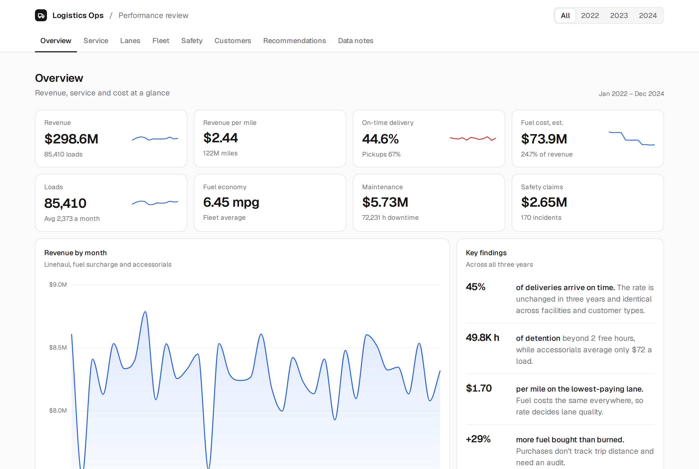
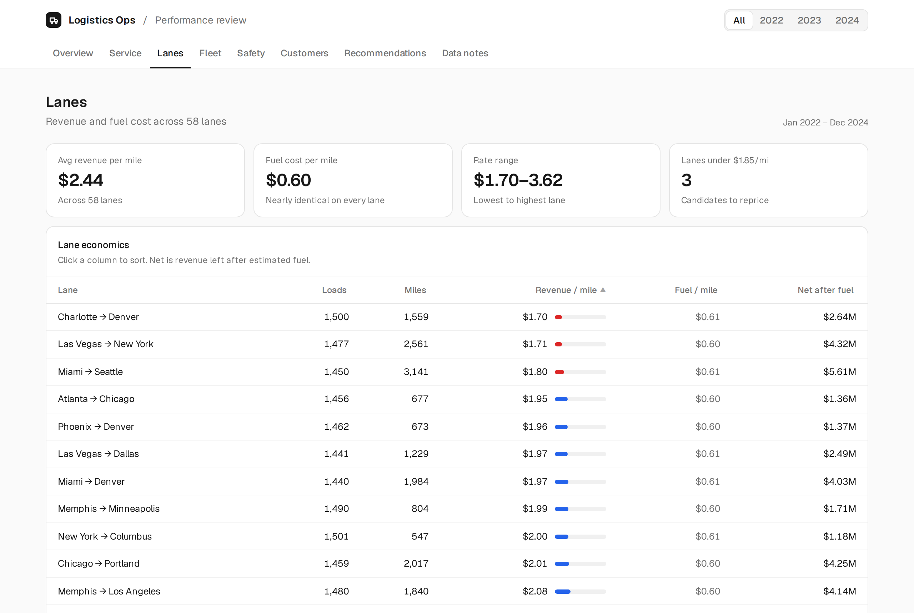
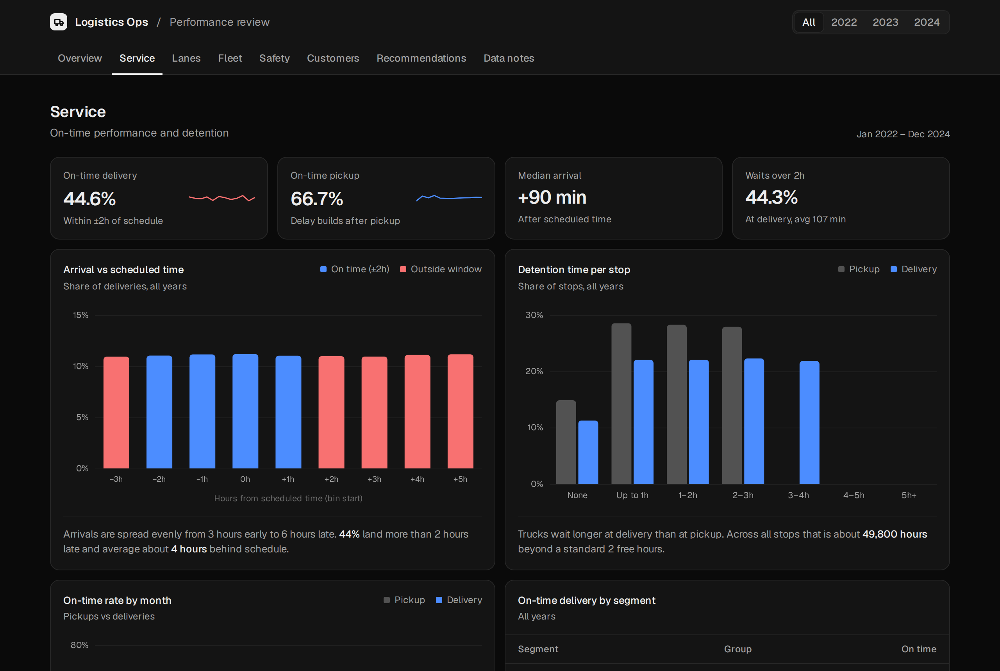
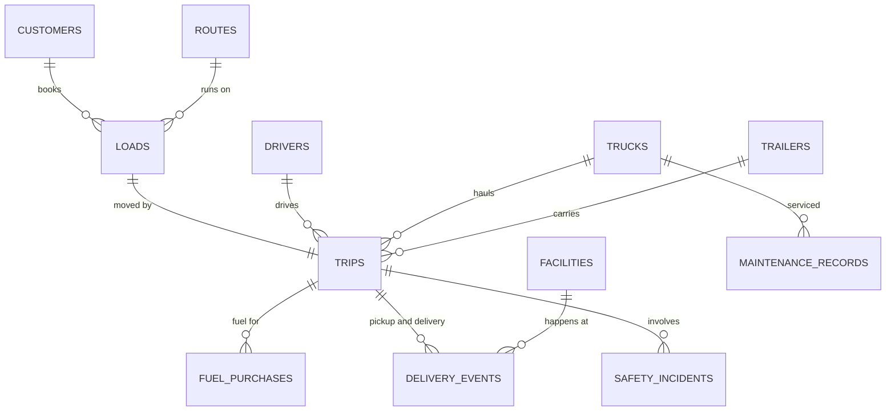

# Logistics Operations Performance Review (2022–2024)

An end-to-end analysis of a trucking company's operations: 85,410 loads, 196,442 fuel purchases, 170,820 delivery events, 2,920 maintenance records and 170 safety incidents across 14 related tables. The output is an interactive dashboard, a PDF report, and a Python pipeline that reproduces every figure.

**[Live dashboard](https://YOUR-USERNAME.github.io/YOUR-REPO-NAME/)** · **[PDF report](report/Logistics_Operations_Review.pdf)**



## Key findings

| | Finding |
|---|---|
| **45%** | Only 45% of deliveries arrive within ±2 hours of schedule. The rate is unchanged for three years and identical across facility types and customer types, which points to how appointments are set rather than driver performance. |
| **49.8K h** | Trucks waited about 49,800 hours beyond a standard 2 free hours at stops, while accessorial charges averaged only $72 a load. |
| **$0.60/mi** | Estimated fuel cost is nearly identical on every lane, so the rate charged decides lane quality. Rates range from $1.70 to $3.62 a mile. |
| **+29%** | Fuel cards bought 29% more fuel than trips recorded burning, and purchases show no relationship to trip distance. This needs an audit. |
| **33%** | A third of maintenance visits were emergencies, on a fleet where 65% of trucks are 2015 models. |
| **38%** | 38% of safety incidents were preventable, worth about $0.9M in claims. |
| **16%** | 16% of revenue came from accounts that are now inactive. |

Revenue held flat at roughly $99M a year. Diesel fell from about $4.20 to $3.65 a gallon, cutting fuel from 26.7% to 23.1% of revenue, while fuel economy stayed flat at 6.45 mpg.

## Recommendations

1. **Rebuild delivery appointment scheduling** from actual transit times and realistic dock waits, and track on-time delivery by lane weekly.
2. **Enforce and bill detention** beyond 2 hours, with automatic arrival and departure capture.
3. **Reprice lanes under about $1.85 a mile** at contract renewal (Charlotte → Denver, Las Vegas → New York, Miami → Seattle).
4. **Audit fuel card spending** by matching each transaction to a truck, trip and location.
5. **Shift maintenance from reactive to planned** for the 2015 trucks, and plan replacements for the units with the most downtime.
6. **Target preventable incidents** through pre-trip inspections, hours-of-service compliance and coaching for drivers with repeat incidents.
7. **Follow up with lost accounts** to learn why they left.

## Dashboard

The dashboard is a single self-contained `index.html` with eight tabs: Overview, Service, Lanes, Fleet, Safety, Customers, Recommendations and Data notes. A year filter shows each year with changes against the previous year. The lane table is sortable, and the page supports mobile and dark mode.

| Lanes | Service (dark mode) |
|---|---|
|  |  |

## Data model



Two additional tables, `driver_monthly_metrics` and `truck_utilization_metrics`, hold monthly aggregates.

## Method

- **Revenue** is linehaul revenue plus fuel surcharge plus accessorial charges.
- **Fuel cost** is estimated as gallons burned per trip × that month's average pump price. Fuel purchase records are not used for cost because they don't match consumption (see below).
- **On time** means within 2 hours either side of the scheduled time, following the `on_time_flag` field.
- **Net after fuel** is revenue minus estimated fuel. The data has no driver pay, insurance or overhead, so this is a contribution figure, not profit.
- **Detention** is waiting beyond a standard 2-hour free window, summed across pickup and delivery stops.

## Data quality issues found

- **Fuel purchases don't match consumption.** 24.5M gallons were bought against 18.9M burned, purchases have no correlation with trip distance, and 201 are dated after the last load.
- **Missing assignments.** 1,714 trips have no driver and 1,672 have no truck, about 2% of trips.
- **Impossible utilization rates.** 436 of 3,312 truck-month records exceed 100%.
- **Duplicate customer names.** There are 200 account IDs under only 107 distinct names.
- **Invalid locations.** Some fuel purchases pair a city with the wrong state (for example New York, AZ).
- **Little variation between drivers** on on-time rate, fuel economy and idle time, so driver rankings on those measures were left out.

## Repository structure

```
├── index.html                      Interactive dashboard (served by GitHub Pages)
├── report/
│   └── Logistics_Operations_Review.pdf
├── analysis/
│   ├── analysis.py                 Reads data/, computes all metrics, builds index.html
│   ├── make_pdf.py                 Renders the PDF report
│   ├── dashboard_template.html
│   ├── report_template.html
│   └── output/data.json            Computed metrics used by the dashboard and report
├── data/                           Place the raw CSV files here (not committed)
├── docs/                           Screenshots
└── requirements.txt
```

## Reproduce the analysis

```bash
pip install -r requirements.txt
# copy the 14 CSV files into data/ (see data/README.md)
python analysis/analysis.py       # rebuilds analysis/output/data.json and index.html

# optional: rebuild the PDF
playwright install chromium
python analysis/make_pdf.py
```

## Tools

Python (pandas, NumPy) for cleaning, joining and analysis; Chart.js for the dashboard; Playwright for PDF rendering.

---

Capstone project by Christian.
